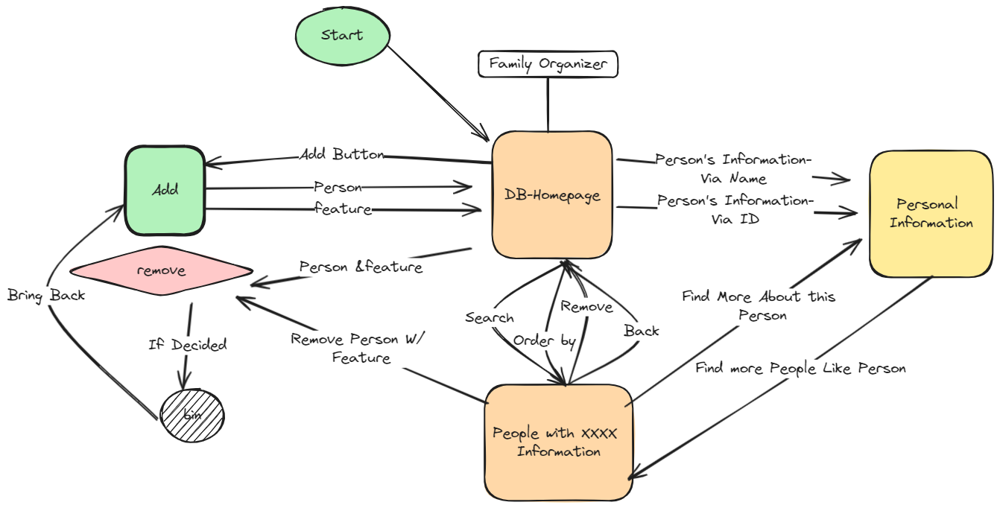
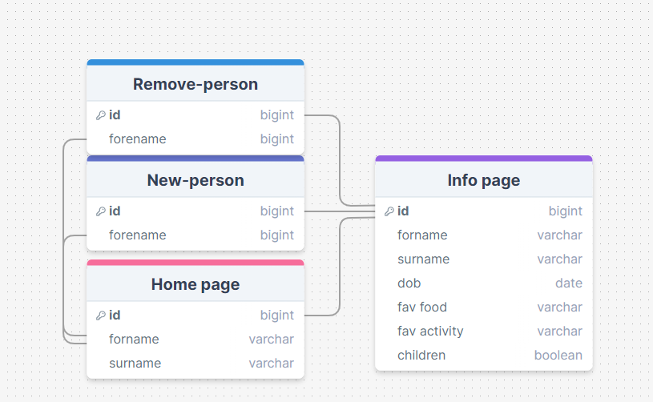
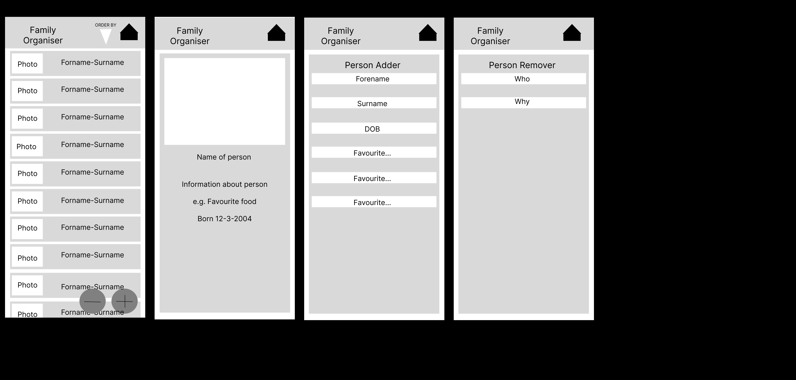

# Development of a Database-Linked Website for NCEA Level 2

Project Name: **Family Organiser**

Project Author: **William Butler**

Assessment Standards: **91892** and **91893**

-------------------------------------------------

## Design, Development and Testing Log

### 16-05-24 -to- 20-05-24

Made Functions map for website

I talked to my family and they said..

>The design for the flow chart was good.

Also finished DB design

My end user had no idea what i was talking about...
### 27-05-24 -to- 30-05-24

Figma

Started Wire frame. Version one.

> end users said the design was good, but needed color.
### 10-06-24

Working on colours in figma

These new design with the colour is finished and ready for feedback.

### Unknown-07-24

Starting development of the base design and functionality of the website

### DATE HERE

Replace this test with what you are working on

Replace this text with brief notes describing what you worked on, any decisions you made, any changes to designs, etc. Add screenshots / links to other media to illustrate your notes where necessary.

### DATE HERE

Replace this test with what you are working on

Replace this text with brief notes describing what you worked on, any decisions you made, any changes to designs, etc. Add screenshots / links to other media to illustrate your notes where necessary.