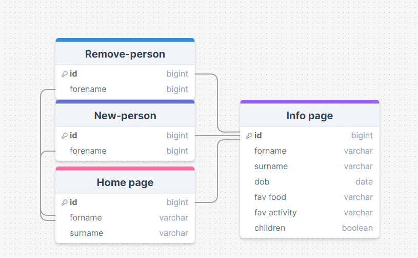

 The Design of a Database-Linked Website for NCEA Level 2

Project Name: **Family or Person Organiser**

Project Author: **William Butler**

Assessment Standards: **91892** and **91893**

-------------------------------------------------

## System Requirements

### Identified Need or Problem

People can forget information about loved ones as they age, and this can cause awkward encounters with said people. they need a way to recall and look at the information about people, so that the meetings wont be so awkward this can also be used in a business standard, as admins can put information about people, where there are many people

### End-User Requirements

Typical end users are going to be grandparents and other quite forgetful people who need a quick reminder about their loved ones, or bosses who need to store other employees information in a business standard, but can also be used in any gathering place, so you can store information about anything e.g. cats, plants, cars, shops, people.

### Proposed Solution

This website/app will have all the information about your family or employees in one neat place, with information about their favourite food or date of birth, this also can be changed to hold other information, such as 'least favourite ...'. this website will hold the information about one person, until that person is removed or deleted from the website. the user can also add new people and change information about a person. The website has a search bar so a person can find a certain item in the list. there is also an order bar, so the user can order the list by e.g. date of birth, while the site finds the closest dob to the start of the year or find the closest to the current date.

-------------------------------------------------

## Relevant Implications

### Functionality

Everything works, and works well.

This implication is important to make sure that the site works as it is supposed to and wont break when it is used 

When i am making the website, i will need to be cautious of errors in my code, at the end of the development i will need to test all the features in the site

### Usability

Getting Things Done Quickly and Easily

This implication is important as when the users are using the website, that everything works as it should, and doesn't slow down during use

When i am making the website, i will need to be cautious of weird mistakes that make the site not work as it should

### Aesthetic

Great Designs with Style and Impact

This implication is very important because without it, many of the users would not use the site because it would look bad and not nice to use

Without aesthetics, a website can look clunky and bland, with everything out of shape and not in lines or with colors. this is also important because without plenty of colour, it may be hard to use.

### End-User

Meets the User's Specific Needs

Because the website is going to be used by people who have degrading memory and/or sight, this website need to accompany plenty of tools to help these specific people

When i am building the website, i need to be exact with my planning and making sure that my site comes out the way it should with plenty of features to help these people

### Social

Try to Have a Positive Social Impact

This implication is extremely important as there are plenty of ways to make sure that peoples information is kept safe, with even more ways to make it so that the information isn't kept safe.

I will need to take extra care when making the site, so that i don't add ways to track or find out extra information about the people in my website, e.g. emails, ph numbers.

 
### Privacy

Making Sure End-User Data Remains Private

This implication is also extremely important as i am putting peoples information in the site

When i build the site i will have a look at password protecting my site and making sure that my users information is extremely important.

-------------------------------------------------
-------------------------------------------------

## Final System Design

### Database Structure

### User Interface Design

-------------------------------------------------

## Completed System

### Database Structure

Place a image here that shows the *actual database structure* that you implemented: tables, fields and relationships.

### User Interface Design

This is the finnished ui in action

https://github.com/user-attachments/assets/737e9974-0fcf-40f6-9850-f60a64184117

-------------------------------------------------

## Review and Evaluation

### Meeting the Needs of the Users
The needs of my users were quite simple, with the majority of end users over the age of 40, the design had to be simple, efficient and look great.
These needs were somewhat met, with the final Design being funtional to a point, and although the design was simple and easy to use, the greater website was not.

### Meeting the System Requirements

The system requirements for this project were to be so that the website could be used on a computor as well as a phone. although no tersting was done on a phone screen, the website used an unsentered table and links, which would have shown poorly on a phone screen

### Review of Funtionality

My website was not funtional to the standard i wanted, however the design was moderatly funtional with existing data and this was not set to usefull or avalible

### Review of Usability

The Design of the website was useable, and in the last final devolopment days the site was not usable, and this was a last minuite job with many of the features i had initially planned on adding not making the final design.

### Review of Aesthetic

When i had completed the table and the other esential parts of the design, i removed the pico css and added an old desing from another website.
This caused the table and other parts of the css to fall apart and out of place. I did not fix this 

### Review of End-User

The end user was a hard requirement to complete, and it was not met.

### Review of Social

When i was designing the website, the idea of a limited capability website came to mind, this would use features like blockers for harsh, mean or rude language. This was not met

### Review of Privacy

Privacy was a Large part of the design, with the manyt people going to be added to the webstie, in needed a lot of measures, some included: a login system, not showing anything personal other that favourite topics and photos.
These were not met becasue of the trouble i had during database connection
